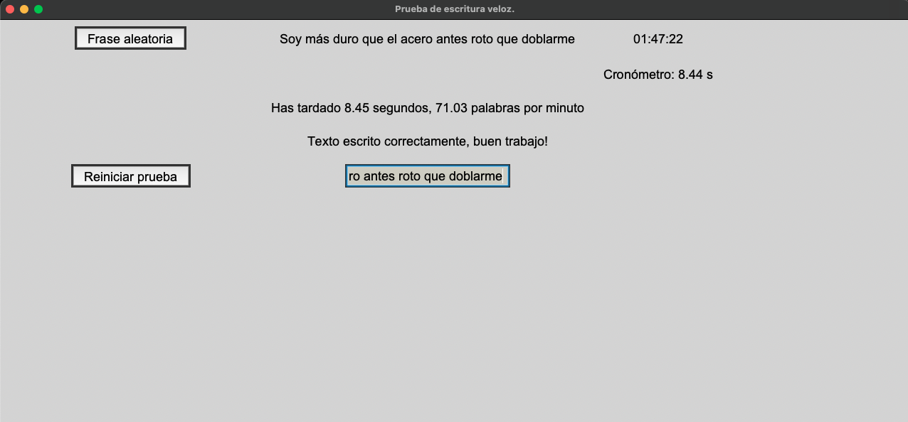

# Prueba_escritura_veloz

Medidor de velocidad de escritura, midiendo las palabras escritas por minuto.

## Funciones
### Contiene:
* Un botón que escoge una frase al azar.
* Un botón de reinicio.
* Reloj y cronómetro.
* Entrada de texto.

## Librerias

Implementación de las siguientes librerías:
* tkinter
* time
* random

# 🖼️ Imagen ventana prueba escritura veloz

# ✉️ Contacto
mactoscan@gmail.com
